# How Akceo works

This document explains Akceo at three levels. Read as far as you need.

1. [In plain terms](#in-plain-terms): what Akceo is and why you might use it.
2. [The user's experience](#the-users-experience): what it's like to write, build and present a
   deck.
3. [Under the hood](#under-the-hood): how the code turns Markdown into a deck.

The exact file format is in [syntax.md](syntax.md), and the notes setup is in
[speaker-notes.md](speaker-notes.md).

---

## In plain terms

Akceo turns a text outline into a slide deck.

You write your slides as plain text, with a few simple marks for headings, lists and emphasis.
Akceo reads that text and produces one file that is the whole presentation. Double-click the
file and it opens in a web browser, ready to present.

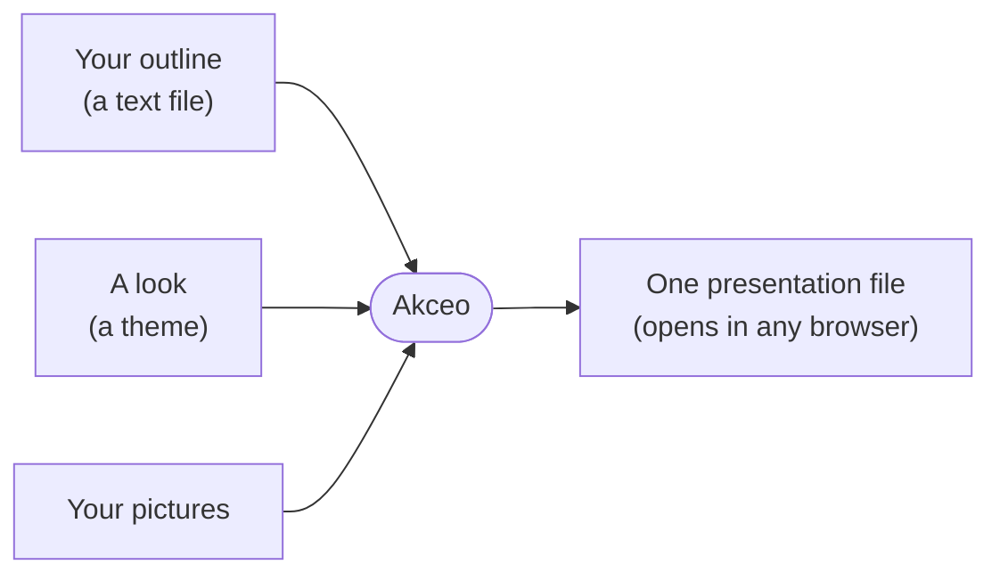

**Why work this way?**

- **You write, Akceo designs.** There are no boxes to drag or fonts to match. Every slide
  follows the same layout rules, so the deck looks consistent without effort.
- **One file, no surprises.** Pictures are packed inside the file. It works offline and on any
  computer, and nothing goes missing when you email it.
- **Change the look in one step.** The same outline can be rebuilt in a dark or light theme, or
  in your own brand colors.
- **Text is easy to keep.** A plain-text deck can be versioned, compared, reused and reviewed
  like any other document.
- **Private notes.** Your speaker notes open in a separate tab that the audience never sees.

**Who it's for:** people who present often and would rather write than lay out slides. Think
engineers, founders, and anyone giving a design review or a pitch.

**What it isn't:** a drawing tool. Akceo has six fixed layouts, and that restraint is the point.
If a slide needs free-form design, make that one image in another tool and drop it into a
`split` slide.

---

## The user's experience

### The whole journey

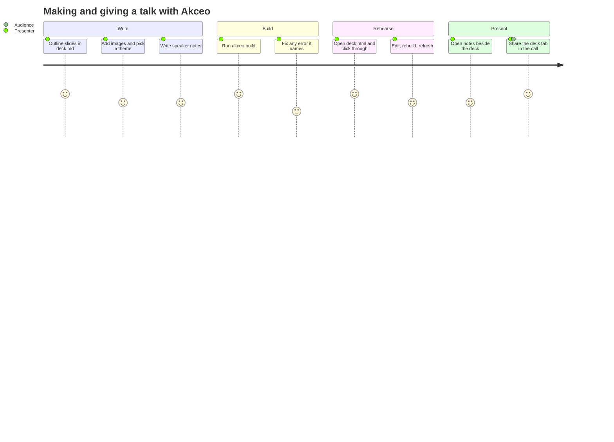

### Writing

A deck is one Markdown file. A short config block at the top sets the title and theme. Then each
slide follows a `---` line, and a few header lines choose its layout:

```markdown
title: Q3 Review
theme: midnight

---

layout: title
kicker: Q3 review

# Shipping faster

---

kicker: The problem

## Builds take too long

- **Full rebuilds** on every change.
- CI queues back up at ==peak hours==.
```

There are six layouts: `title`, `bullets`, `split` (image beside text), `steps`, `table` and
`image` (an image on its own).
The inline marks are small: bold, a strong color, an accent color, dimmed asides and code.

### Building

```sh
akceo build deck.md
```

It prints the output file, its size and the slide count:

```text
wrote deck.html (12 KB, 7 slides)
```

If something is wrong, the build stops and says exactly where, instead of producing a broken
deck:

```text
akceo: deck.md:14: slide 3: the steps layout needs a 1. list
```

The message gives the file, the line, the slide number and what to change. Typos in keys, a key
on the wrong layout, a missing image and content a layout can't show are all caught this way.

### The edit loop

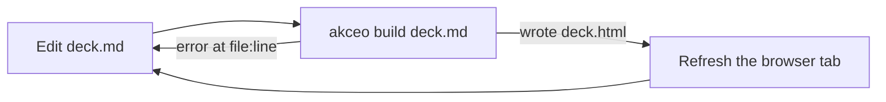

### Presenting

Open `deck.html` in a browser.

| Action | Keys |
| --- | --- |
| Next slide | `→`, `Space`, `PageDown`, or click the right half |
| Previous slide | `←`, `PageUp`, or click the left half |
| First or last slide | `Home`, `End` |
| Full screen | `F` |

A thin progress bar runs along the bottom, with a slide counter in the corner. Selecting text
doesn't change slides, so you can copy from a slide mid-talk.

The address bar shows the current slide as `#N`. A link to `deck.html#4` opens slide 4, and a
reload after a rebuild brings you back to the slide you were on.

### Presenting with private notes

Your notes live in a Markdown file. You read them in `md-viewer.html`, a small page that
`akceo viewer` writes out. Put the deck and the viewer side by side in one Chrome window, and
share only the deck tab in your call. When you save the notes file, the viewer updates by itself.
[speaker-notes.md](speaker-notes.md) walks through the setup.

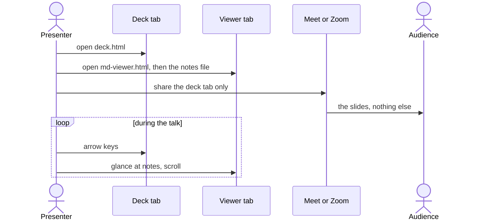

---

## Under the hood

### Design goals

- **Self-contained output.** The built page references no external file or URL. CSS,
  JavaScript and images are all inside it.
- **One runtime dependency.** Pillow, for shrinking images. Everything else is the Python
  standard library, and the page uses plain JavaScript with no framework. The Mermaid CLI
  (`mmdc`) is an optional outside tool, needed only for decks that use `.mmd` diagrams.
- **Fail loudly and precisely.** Input is checked before anything is written. Every error names
  the file it's about, and errors in the deck also give the line and slide.
- **Content and look are separate.** The deck says what's on each slide; the theme alone decides
  colors and fonts.

### Modules

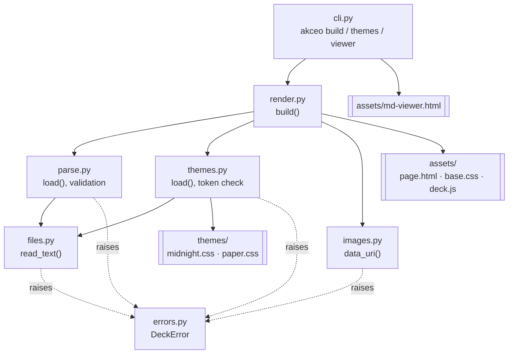

| Module | Job |
| --- | --- |
| `cli.py` | Parses arguments, runs a command, writes the output, turns `DeckError` into a message and exit code 1 |
| `render.py` | Runs the build: loads the deck and theme, embeds images, renders each slide, fills the page template |
| `parse.py` | Turns Markdown into a validated `Deck`. All input rules live here. |
| `themes.py` | Finds a theme by name or path, checks that it sets every token, and reads the token values that Mermaid diagrams use |
| `images.py` | Turns an image file into a `data:` URI, shrinking raster images and drawing Mermaid diagrams with `mmdc` |
| `files.py` | Reads user files, turning read and decode failures into `DeckError` |
| `errors.py` | `DeckError`, the one exception type the CLI reports to the user |

### The build pipeline

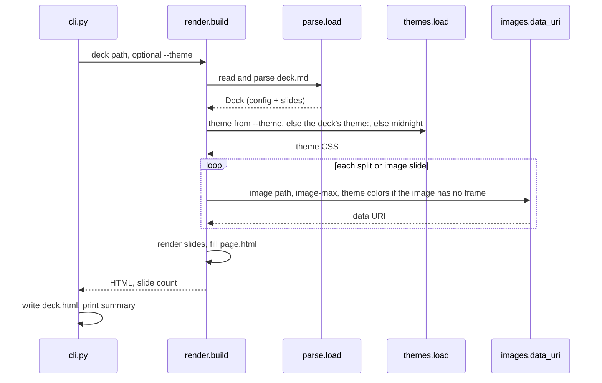

### Parsing

Parsing runs in stages, each working on the output of the one before:

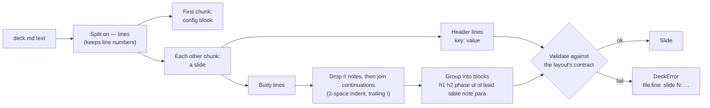

Each layout has a contract, set in data at the top of `parse.py`:

- the header keys it accepts (`LAYOUT_KEYS`)
- the blocks it renders, and whether each may repeat (`LAYOUT_BLOCKS`)
- the blocks it requires (`REQUIRED_BLOCKS`)

Anything outside the contract is an error rather than something silently dropped.

The parsed result is a small, immutable data model:

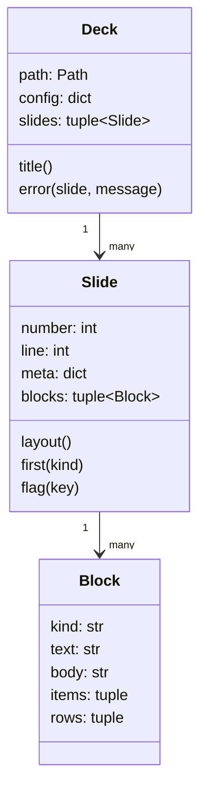

### Rendering

`render_slide` writes one `<section class="slide">` per slide, choosing markup by layout. Inline
text goes through `inline()` in a fixed order. This order is why markup inside backticks stays
literal and why raw HTML is always escaped:

1. Set aside `` `code` `` spans, so nothing else touches them.
2. Escape HTML (`&`, `<`, `>`).
3. Apply `***strong***`, `**bold**`, `==accent==` and `((dim))`.
4. Put the code spans back, escaped.
5. Turn hard line breaks into `<br>`.

The page comes from `assets/page.html`, which has four placeholders filled in one pass: title,
styles, slides and script. Filling them in one pass means slide text that happens to contain a
placeholder name is never replaced.

### Themes

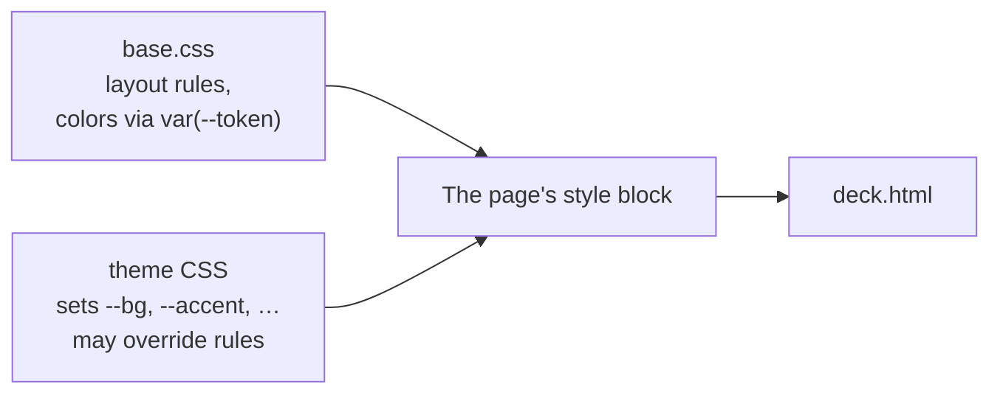

`base.css` holds only layout. Every color and font in it comes from a CSS custom property, such
as `var(--accent)`. A theme is a CSS file that sets those properties. It's added after
`base.css`, so it can also override any layout rule. `themes.load` rejects a theme that leaves
out a token, or that contains `</style`, which would end the style block early. The token list
is in [syntax.md](syntax.md#themes).

### Images

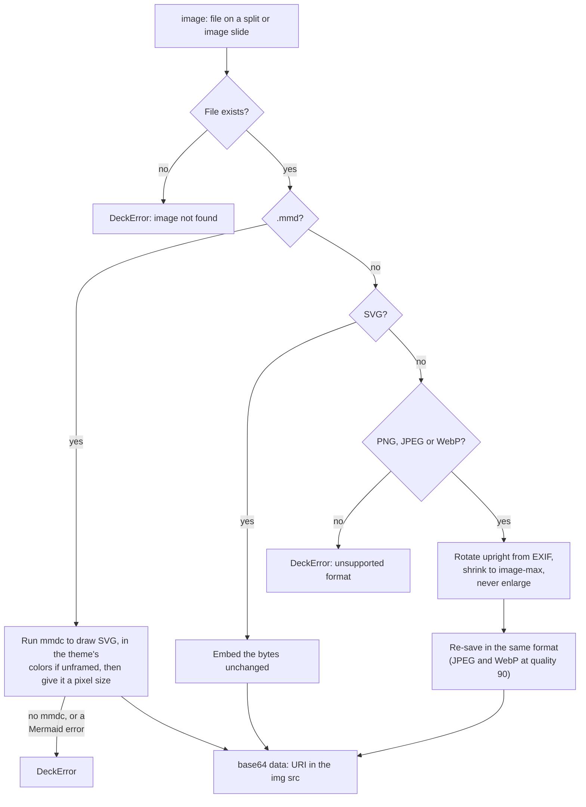

Images are processed on every build, so replacing an image file and rebuilding just works.

### Errors

Every problem the user can fix is a `DeckError`, with a message in one of these forms:

```text
deck.md:14: slide 3: the steps layout needs a 1. list
deck.md:2: unknown config key 'diagrams' (expected one of: title, theme, images)
theme brand.css doesn't set: --figure-bg
```

`cli.main` catches `DeckError`, prints `akceo: <message>` to stderr and exits with code 1.
Anything else is a bug in Akceo, and it shows a normal Python traceback.

### The page at runtime

`deck.js` is small. It shows one slide at a time by toggling an `active` class,
moves the progress bar and counter, and maps keys and clicks to next and previous. A click is
ignored while text is selected. On load it opens the slide named in the URL hash. On each move
it writes the new number back with `history.replaceState`, so stepping through slides doesn't
fill the browser history. A hash typed into the address bar moves to that slide.

### The notes viewer

`md-viewer.html` is a separate, self-contained page with its own small Markdown renderer. Live
refresh uses Chrome's File System Access API. That API is available to pages opened from disk,
so no server is needed.

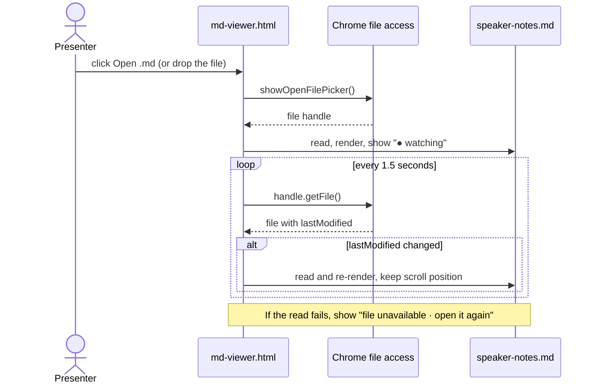

In browsers without that API, the viewer still opens files, but you drop the file again to
refresh.
