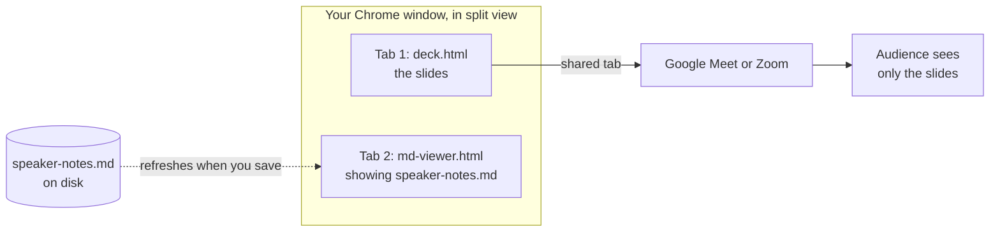

# Speaker notes

An Akceo deck has no built-in presenter view. You keep your notes in a Markdown file and read
them in a second browser tab with `md-viewer.html`. In a video call you share only the deck tab,
so your notes stay private.



## Set it up

1. **Write your notes** in a Markdown file next to your deck, for example `speaker-notes.md`.
   The [notes format](#notes-format) below has a suggested layout.
2. **Get the viewer.** `akceo viewer` writes `md-viewer.html` into the current folder. Use
   `-o` to put it somewhere else. You only need one copy; it can open any notes file.
3. **Open the deck** (`deck.html`) in Chrome.
4. **Open the viewer** (`md-viewer.html`) in a second tab. Click **Open .md** and pick your notes
   file, or drag the file onto the page.
5. **Put the tabs side by side** with Chrome's split view, so both sit in one window.
6. **Present.** Share the deck tab in your meeting, and read your notes from the other half of
   the window.

### Try it with the demo

```sh
akceo build examples/demo/deck.md
akceo viewer -o examples/demo
```

Open `examples/demo/deck.html` and `examples/demo/md-viewer.html` in two tabs. In the viewer,
open `examples/demo/speaker-notes.md`. Its sections match the demo's seven slides.

## Sharing in a meeting

The idea is to share the one tab that holds the slides, not your whole screen.

- **Google Meet** in Chrome can share a single tab. Choose to present a tab and pick the deck.
- **Zoom's desktop app** shares a screen or a window rather than a tab. With split view, the
  window includes your notes. Either share just the part of the screen that holds the deck, or
  keep the deck in its own window and share that.

## Live refresh

In Chrome and Edge, the viewer watches the file you opened. When you save the notes, the page
updates within about two seconds and keeps your scroll position. The header shows
**● watching** while this is on. It works when the viewer is opened straight from disk, with no
web server.

- If the file is moved or deleted, the header shows **file unavailable · open it again**.
- Reloading the viewer tab forgets the file. Open it again.
- Other browsers can't watch files. Drop the file on the page again to refresh.

**A−** and **A+** change the text size, and the viewer remembers the size for next time.

## Notes format

Any Markdown works. This layout reads well in the viewer:

```markdown
# Speaker Notes · My talk

---

### 1 · Opening *(0:30)*
What to say on the first slide.

### 2 · The problem *(1:00)*
- A point to hit
- Another point
```

- One `###` heading per slide, numbered to match the deck, makes it easy to keep your place.
- An italic part in a heading, like `*(0:30)*`, shows in small amber type. It's a good spot for
  a time budget.

The viewer handles:
- headings
- paragraphs
- **bold**, *italic* and `code`
- links
- images
- bulleted and numbered lists, nested by indenting
- tables
- quotes
- fenced code blocks
- horizontal rules

Only `http`, `https`, `mailto` and relative links become clickable. Links open in a new tab.

Images use ``. A relative path resolves from the folder that holds `md-viewer.html`,
not from the notes file, because the browser doesn't tell the viewer where the notes file lives.
So keep the viewer next to your notes: `akceo viewer -o <notes folder>`. `http(s)` and
`data:image/` sources work too. Any other source shows the alt text instead.

## Limits

- The notes don't follow the slides. Scroll the viewer as you go.
